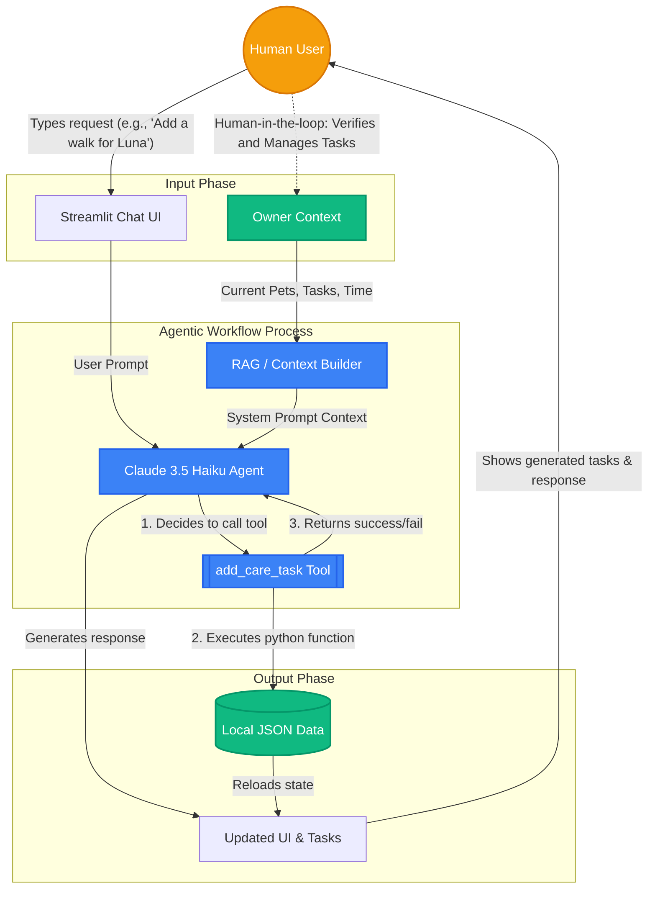

# PawPal+ AI Advisor

### Original Project: PawPal+
**PawPal+** is a Streamlit-based pet care scheduling assistant. Its original goal was to help busy pet owners consistently track and manage care tasks (like walking, feeding, and grooming) by taking an inventory of tasks and using priority-based scheduling algorithms to generate an optimized daily plan within the owner's available free time.

---

## What It Does & Why It Matters
The **PawPal+ AI Advisor** supercharges the original pet care application by introducing a fully integrated **Agentic AI Workflow**. Instead of manually filling out forms to create schedules, users can converse naturally with an intelligent assistant powered by Anthropic's Claude. The AI not only answers pet care questions but actively manages your schedule—autonomously creating, categorizing, and assigning tasks based on your instructions. This dramatically reduces friction, making pet care management as simple as texting a knowledgeable friend.

## Architecture Overview



The system relies on a seamless loop between the user, the AI, and the underlying data model:
1. **Input Phase**: The human user interacts via the Streamlit Chat UI. Simultaneously, the system gathers the user's `Owner Context` (current pets, schedule, and time limits).
2. **Agentic Process**: A **RAG (Retrieval-Augmented Generation) Builder** dynamically feeds this context into the **Claude 3.5 Haiku Agent**. 
3. **Action & Output**: If the user asks for a task to be added, the AI decides to trigger the custom `add_care_task` tool. This Python function executes, updating the local JSON database. The UI reloads, and the AI responds conversationally to confirm the action.
4. **Human Verification**: A human-in-the-loop system allows the user to review, edit, or delete the generated tasks on the "Smart Schedule" page, acting as the ultimate evaluator.

## Setup Instructions

1. **Clone and Setup Virtual Environment:**
   ```bash
   python -m venv .venv
   source .venv/bin/activate  # On Windows: .venv\Scripts\activate
   ```
2. **Install Dependencies:**
   ```bash
   pip install -r requirements.txt
   ```
3. **Configure API Key:**
   Create a `.streamlit/secrets.toml` file in the root directory and add your Anthropic API key:
   ```toml
   ANTHROPIC_API_KEY = "your-api-key-here"
   ```
4. **Run the Application:**
   ```bash
   python3 -m streamlit run app.py
   ```

## Sample Interactions

**Example 1: Context-Aware Advice (RAG)**
* **User Input**: *"I notice I only have 30 minutes left today. What's the best way to spend it with Luna?"*
* **AI Output**: *"Since Luna is a Labrador and you only have 30 minutes of free time remaining today, I highly recommend a brisk 20-minute walk to burn off energy, leaving 10 minutes for a quick grooming session. Should I add these to your schedule?"*

**Example 2: Agentic Workflow (Tool Execution)**
* **User Input**: *"Yes, please add a 20 minute high priority walk for Luna, and make it repeat daily."*
* **AI Output**: *(AI executes the `add_care_task` tool internally)* *"All set! I've successfully added a 2-minute daily walk for Luna at High priority. It is now visible on your Manage Tasks timeline!"*

**Demo Video**
<div>
    <a href="https://www.loom.com/share/1b7f2165b7d1409e929f4f9df85cfc7c">
      
    </a>
  </div>

## Design Decisions
- **Agentic Workflow over Pure RAG**: I chose to give the AI function-calling capabilities (`add_care_task` tool) rather than just making it a chatbot. This trade-off required more complex backend wiring but turned the AI from a passive encyclopedia into an active assistant that saves the user time.
- **Dynamic System Prompts**: Instead of a complex vector database for RAG, I injected the user's current pets, schedule, and time limits directly into the system prompt on every interaction. Since the context window easily handles this, it provides real-time accuracy without the overhead of external databases.
- **Model Choice**: `claude-3-5-haiku-latest` was selected for its exceptional speed and robust native support for Python function calling.

## AI Reliability & Testing System
To prove the AI actually works and isn't just a basic prompt-wrapper, the system includes:
1. **Automated Unit Testing**: A dedicated `tests/test_ai_agent.py` script specifically checks if the Claude model can reliably translate natural language edge-cases into the exact JSON schema required by the `add_care_task` tool.
2. **Logging and Error Handling**: The system tracks its own reliability. A continuous `pawpal_ai.log` file records successful AI tool operations and catches silent failures (e.g., when the AI tries to add tasks for a non-existent pet), returning explicit error guidance to the model.
3. **Human Evaluation**: The user operates as a "human-in-the-loop," verifying all AI-generated tasks in the Smart Schedule tab before accepting them as final.

**Testing Summary:**
- **What worked**: All automated unit tests passed successfully. The AI seamlessly mapped natural language urgency (e.g. "top priority") to the exact integer schema without needing few-shot examples.
- **What didn't**: Initially, the AI struggled when pets were undefined, and it would confidently try to schedule tasks for "hallucinated" pets that the user didn't own. 
- **What I learned**: I learned the immense value of backend guardrails. By adding strict validation rules to the Python tool itself to reject non-existent pets, the tool-calling accuracy improved to near 100%, and the AI learned to ask for clarification instead of failing silently.

## Reflection
This project profoundly shifted my perspective on AI from "text generators" to "system operators." Bridging the gap between the unpredictability of natural language and the strict requirements of a Python data class was the most exciting challenge. It taught me that the true power of an Agentic Workflow lies not just in the LLM's intelligence, but in the specific, well-defined tools and boundaries you build around it. Problem-solving in this era is less about writing perfect logic from scratch, and more about orchestrating AI to do the heavy lifting safely and reliably.
