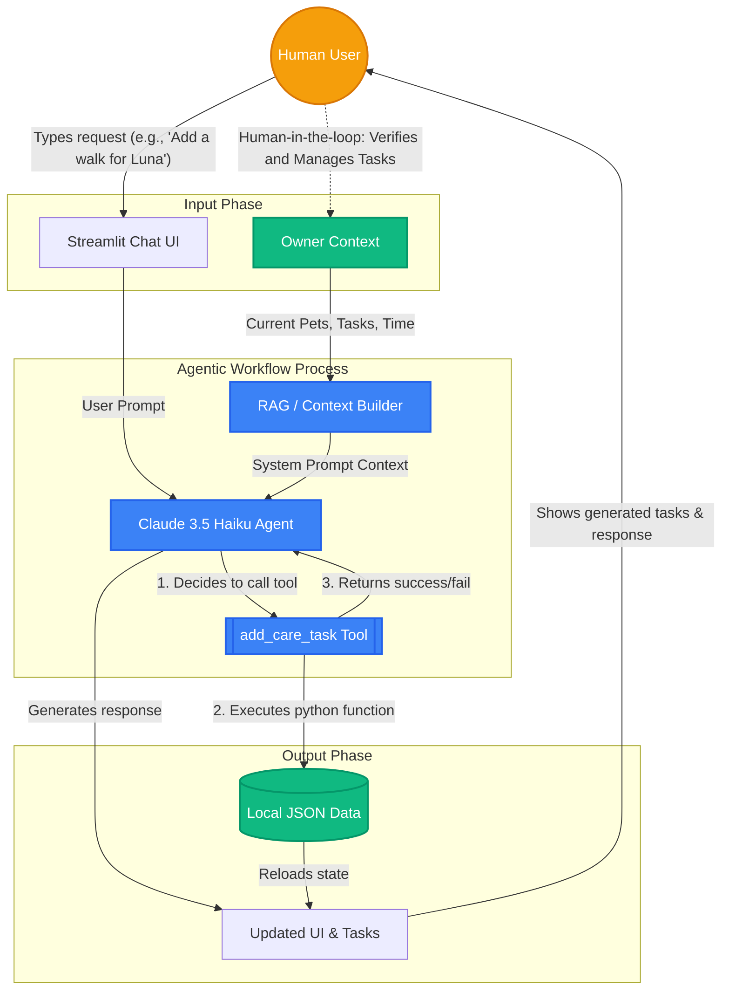

# PawPal+ AI System Diagram

Here is a breakdown of how the new Agentic AI Workflow is integrated into the PawPal+ system.

### Component Breakdown
1. **Input**: The human user interacts via the Streamlit Chat UI. The system also retrieves the `Owner Context` (pets, time limits, existing schedule).
2. **Process**: The **RAG / Context Builder** passes the user's data to the **Gemini Agent**. The agent processes the input and, if necessary, autonomously calls the **`add_care_task` tool** to act on the user's behalf.
3. **Output**: The tool modifies the underlying **Local JSON Data**, and the agent generates a conversational response shown to the user on the **Updated UI**.
4. **Human Involvement**: The human user acts as the evaluator (human-in-the-loop). Once the AI adds tasks to the system, the user verifies them in the "Manage Tasks" or "Smart Schedule" tabs and can delete or modify any hallucinations or incorrect priorities.
