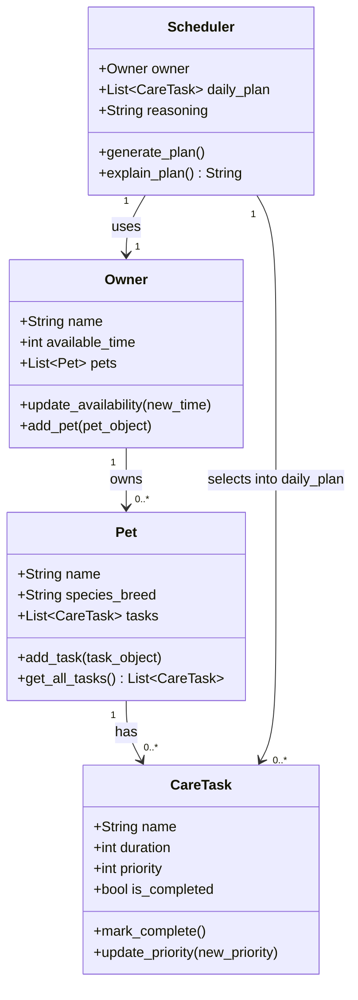

```mermaid
classDiagram
    class Owner {
        +String name
        +int available_time
        +List~Pet~ pets
        +update_availability(new_time)
        +add_pet(pet_object)
    }

    class Pet {
        +String name
        +String species_breed
        +List~CareTask~ tasks
        +add_task(task_object)
        +get_all_tasks() List~CareTask~
    }

    class CareTask {
        +String name
        +int duration
        +int priority
        +bool is_completed
        +mark_complete()
        +update_priority(new_priority)
    }

    class Scheduler {
        +Owner owner
        +List~CareTask~ daily_plan
        +String reasoning
        +generate_plan()
        +explain_plan() String
    }

    Owner "1" --> "0..*" Pet : owns
    Pet "1" --> "0..*" CareTask : has
    Scheduler "1" --> "1" Owner : uses
    Scheduler "1" --> "0..*" CareTask : selects into daily_plan
```