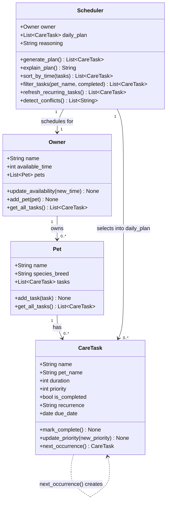

## What changed from Phase 1

| Class | Change |
|---|---|
| `CareTask` | Added `pet_name`, `recurrence`, `due_date` fields; added `next_occurrence()` method |
| `Owner` | Added `get_all_tasks()` method |
| `Scheduler` | Added 4 Phase 3 methods: `sort_by_time`, `filter_tasks`, `refresh_recurring_tasks`, `detect_conflicts` |
| Relationships | Added `CareTask ..> CareTask` dashed arrow showing `next_occurrence()` self-association |